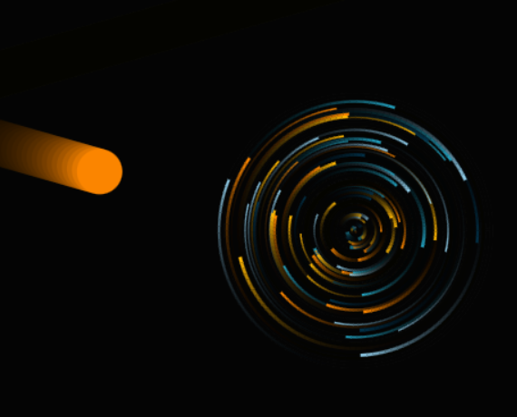
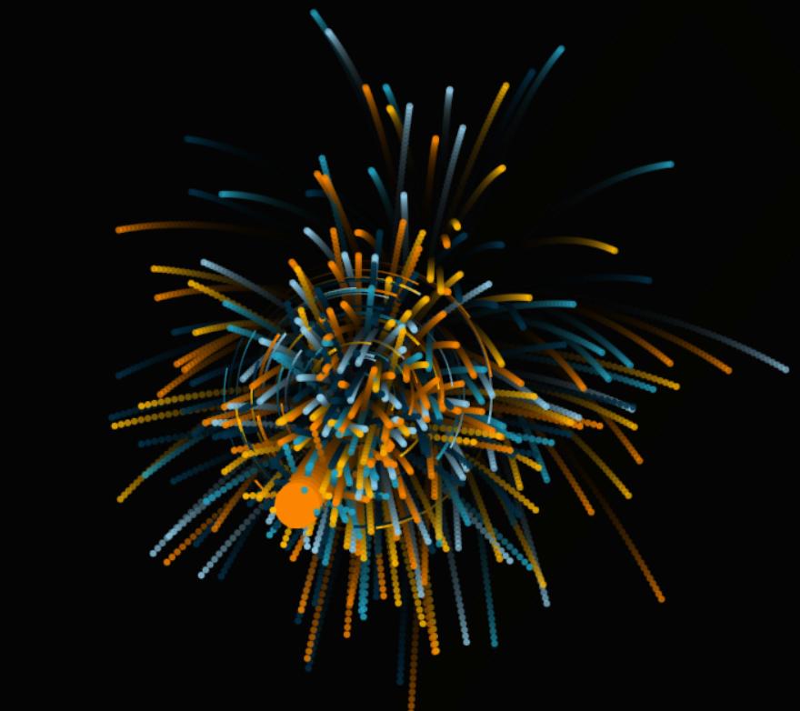

# 🎇 Particle Clash

<div align="center">
  
  
</div>  

An HTML5 canvas experiment where particles collide and explode into colorful fragments.  
Built with **JavaScript** and **Canvas API**, this project simulates orbital motion, bouncing particles, and explosion effects.

---

## 🚀 Features
- **big particle** circular motion around the canvas center.  
- **small particle** collides with big particle.  
- **explosion effect** when small particle collides with big particle  
- Smooth animations with a fading trail effect.  

---

## 🛠️ Tech Stack
- **JavaScript (ES6)**  
- **HTML5 Canvas API**  

---

## 📂 Project Structure
├── images
│ ├── pic1.png
│ ├── pic2.png
├── index.html 
├── particle-clash.js 
└── README.md 

---

## ⚡ Getting Started

1. Clone the repository:
   ```bash
   git clone https://github.com/your-username/particle-clash.git
2. Navigate into the project folder:
    cd particle-clash
3. Open index.html in your browser.
